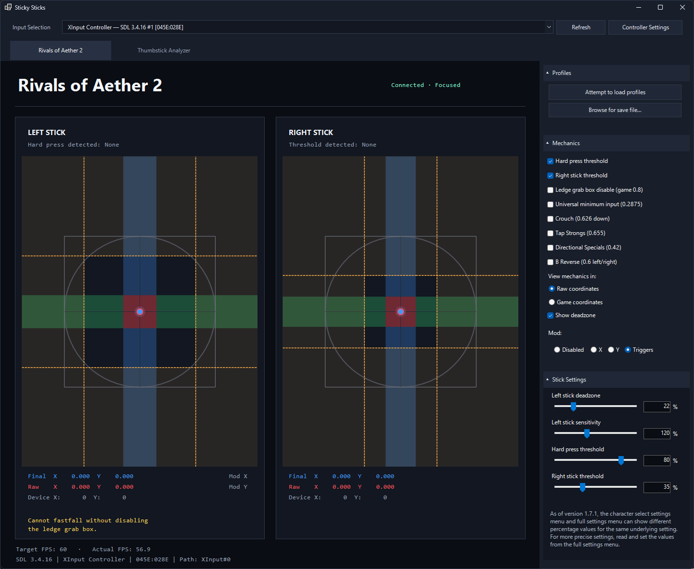

# Sticky Sticks

A Windows controller visualizer and thumbstick analyzer, with a settings preview for **Rivals of Aether 2**. Version **0.3**.



## Run

Download the `StickySticks-vX.Y-win-x64.zip` asset from **Releases** on GitHub, extract it, then run `StickySticks.exe`.

Requires Windows x64 and the [.NET 10 Desktop Runtime (x64)](https://dotnet.microsoft.com/en-us/download/dotnet/10.0). The SDK is only needed to build. If the runtime is missing, the launcher offers a download link. Rivals and Steam are not required. Downloads are unsigned and may trigger Windows reputation warnings.

## Supported Input sources

Keyboard, SDL 3, XInput, Direct USB for Nintendo Switch Pro controllers and Wii U-compatible GameCube adapters, Windows joystick API.

## Build and test

Install the [.NET 10 SDK](https://dotnet.microsoft.com/en-us/download/dotnet/10.0), then run in PowerShell:

```powershell
./build.ps1
```

Output goes to `publish/`. Close a running copy before rebuilding. Native dependencies and their licences are included in this repository; no game installation or NuGet packages are needed. `NuGet.Config` intentionally clears external feeds. The build is framework-dependent, not self-contained.

```powershell
$test = Start-Process ./publish/StickySticks.exe -ArgumentList '--self-test' -Wait -PassThru
if ($test.ExitCode -ne 0) { throw 'Tests failed' }
```

## Licence

Sticky Sticks is [MIT licensed](LICENSE). SDL and SDL GameControllerDB use zlib licences; the dynamically loaded libusb library uses LGPL-2.1-or-later. See [third-party notices](THIRD_PARTY_NOTICES.md). This independent project is not affiliated with Aether Studios, Nintendo, Microsoft, or Valve.
